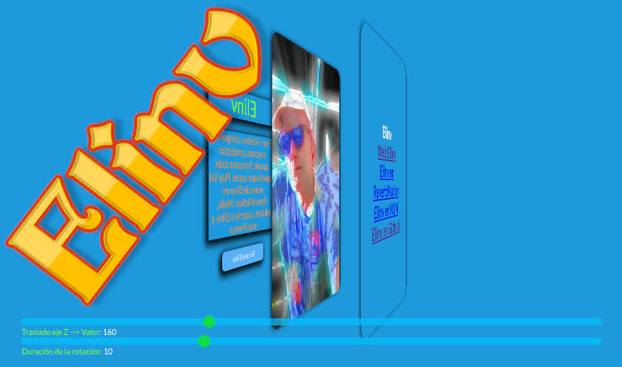

# css_flip_card_3d_animation
    En Html5 con CSS y un poco de Javascript, 
    una tarjeta con animación automática, 
    que rota 360 grados mostrando dos imágenes y textos. 
    Regulable distancia eje Z y duración.

##Ejemplo de uso:

<a href="https://elinv.musica.ar">
   Web Elinv
</a>

##Web Elinv.

<a href="https://www.elinv.musica.ar/github/cssflipcardanima/" href="_blank">
   Css flip card 3d animation.
</a>

## - Ver info de Elinv en Microsoft Bing Search:

<a href="https://www.bing.com/search?q=elinv" href="_blank">
   Enlace a la info de Elinv  -> en Microsoft Bing Search
</a>

## - Ver info de Elinv en Google Search:

<a href="https://www.google.com.ar/search?q=elinv href="_blank"">
   Enlace a la info de Elinv  -> en Google Search
</a>

## - Ver canciones de Elinv:

<a href="https://www.reverbnation.com/elinv href="_blank"">
   Enlace a las canciones de Elinv  -> en Reverbnation
</a>

<a href="https://www.n1m.com/elinv/ href="_blank"">
   Enlace a la web de Elinv  -> en N1M
</a>

👍 Gracias!

🛠️ Errores, sugerencias, ideas, envialas a nuestro mail: <elinv.elinv@gmail.com>

## 	Demo

# E L I N V

